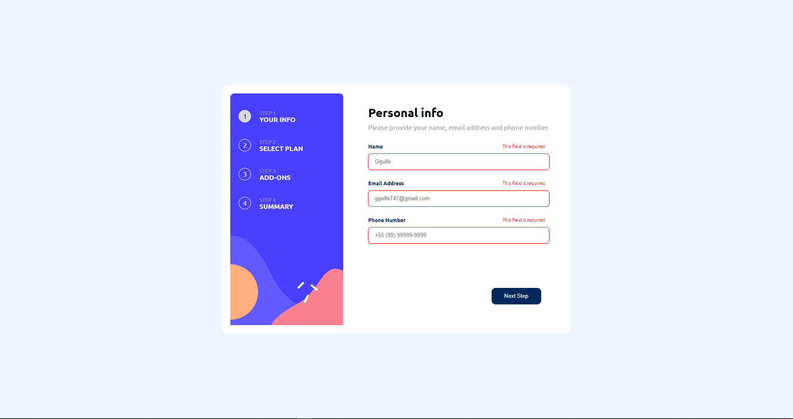

<h1 align="center">Plan</h1>
<p align="center">Projeto simulação de compra de planos</p>


<h3>O que o site proporciona?</h3>

- [x] Site totalmente intuitivo
- [x] Secção de cadastro
- [x] Escolha entre plano Month ou Year (preço e ofertas diferentes em cada pacote de plano)

<hr>
<h1 align="center">
  
</h1>

### 🛠 Tecnologias

As seguintes ferramentas foram usadas na construção do projeto:

- [React](https://pt-br.reactjs.org/)
- React-Router-Dom(para rotas).

### Pré-requisitos

Antes de começar, você vai precisar ter instalado em sua máquina as seguintes ferramentas:
[Git](https://git-scm.com). <br>
Além disto é bom ter um editor para trabalhar com o código como [VSCode](https://code.visualstudio.com/)

### 🎲 Rodando

```bash
# Clone este repositório
$ git clone <https://github.com/Gguife/planPurchase/new/main?readme=1>

# Instale as dependências
$ npm install

# Execute a aplicação em modo de desenvolvimento
$ npm run dev

# O servidor inciará na porta:5173
```
